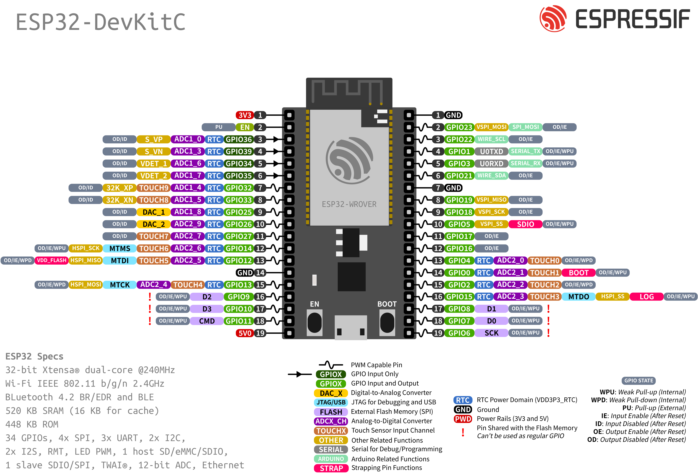

# iot-software

# Levantamiento de IDF

## Ejecutar el siguiente comando para levantar el entorno de desarrollo de ESP-IDF:

```bash
source ~/esp/esp-idf/export.sh
```

## Monitor

Enter to monitor

```bash
idf.py monitor
```

Exit to monitor

```bash
ctrl + ]
```

# Pinlayout de ESP32



# Documentación de ESP32 en C

## 📚 Recursos Oficiales de Documentación

### 1. Documentación Oficial de Espressif

- [ESP-IDF API Reference](https://docs.espressif.com/projects/esp-idf/en/latest/esp32/api-reference/index.html)
- [Guía de Programación de ESP-IDF](https://docs.espressif.com/projects/esp-idf/en/latest/esp32/get-started/index.html)

### 2. Repositorios de Ejemplos

- [Ejemplos Oficiales de ESP-IDF](https://github.com/espressif/esp-idf/tree/master/examples)

## 🔧 Bibliotecas Principales

### Bibliotecas Fundamentales

- `esp_system.h`: Funciones del sistema
- `driver/gpio.h`: Control de GPIO
- `freertos/FreeRTOS.h`: Sistema de tiempo real
- `esp_log.h`: Registro de mensajes
- `esp_wifi.h`: Configuración de WiFi
- `driver/uart.h`: Comunicación serial

## 📖 Referencias Detalladas

### 1. GPIO (Entrada/Salida de Propósito General)

```c
#include "driver/gpio.h"

// Configurar pin como salida
gpio_pad_select_gpio(GPIO_NUM_2);
gpio_set_direction(GPIO_NUM_2, GPIO_MODE_OUTPUT);

// Configurar pin como entrada
gpio_set_direction(GPIO_NUM_4, GPIO_MODE_INPUT);

// Configuraciones avanzadas
gpio_config_t io_conf = {
    .pin_bit_mask = (1ULL << GPIO_NUM_4),
    .mode = GPIO_MODE_INPUT,
    .intr_type = GPIO_INTR_DISABLE,
    .pull_up_en = GPIO_PULLUP_DISABLE,
    .pull_down_en = GPIO_PULLDOWN_DISABLE
};
gpio_config(&io_conf);
```

### 2. Registro y Logging

```c
#include "esp_log.h"

#define TAG "MiAplicacion"

// Tipos de logs
ESP_LOGI(TAG, "Mensaje informativo");
ESP_LOGW(TAG, "Mensaje de advertencia");
ESP_LOGE(TAG, "Mensaje de error");
ESP_LOGD(TAG, "Mensaje de depuración");
```

### 3. Tareas y Multitarea (FreeRTOS)

```c
#include "freertos/FreeRTOS.h"
#include "freertos/task.h"

void mi_tarea(void* pvParameters) {
    while(1) {
        // Código de la tarea
        vTaskDelay(1000 / portTICK_PERIOD_MS);
    }
}

// Crear tarea
xTaskCreate(
    mi_tarea,           // Función de la tarea
    "MiTarea",          // Nombre de la tarea
    2048,               // Tamaño de pila
    NULL,               // Parámetros
    1,                  // Prioridad
    NULL                // Manejador de tarea
);
```

### 4. Comunicación Serial (UART)

```c
#include "driver/uart.h"

// Configuración de UART
uart_config_t uart_config = {
    .baud_rate = 115200,
    .data_bits = UART_DATA_8_BITS,
    .parity = UART_PARITY_DISABLE,
    .stop_bits = UART_STOP_BITS_1,
    .flow_ctrl = UART_HW_FLOWCTRL_DISABLE
};
uart_param_config(UART_NUM_0, &uart_config);
```

### 5. WiFi

```c
#include "esp_wifi.h"
#include "esp_event.h"

// Inicializar WiFi
wifi_init_config_t cfg = WIFI_INIT_CONFIG_DEFAULT();
ESP_ERROR_CHECK(esp_wifi_init(&cfg));

// Configurar modo estación
ESP_ERROR_CHECK(esp_wifi_set_mode(WIFI_MODE_STA));
```

## 🛠 Comandos de Compilación y Depuración

```bash
# Compilar
idf.py build

# Flashear
idf.py -p /dev/ttyUSB0 flash

# Monitor serial
idf.py -p /dev/ttyUSB0 monitor

# Compilar y flashear
idf.py -p /dev/ttyUSB0 build flash

# Limpiar proyecto
idf.py clean
```

## 📚 Recursos Adicionales de Aprendizaje

### Libros y Cursos

- "ESP32 Programming by Example" - Libro
- Cursos en Udemy y Coursera sobre ESP32

### Comunidades

- [Foro Oficial de Espressif](https://www.esp32.com/)
- Grupos de Telegram y Discord de ESP32

## 🔗 Links Importantes

- [Documentación Oficial de ESP-IDF](https://docs.espressif.com/projects/esp-idf/en/latest/esp32/)
- [Repositorio de GitHub de ESP-IDF](https://github.com/espressif/esp-idf)

## ⚠️ Consejos Finales

- Siempre use `ESP_ERROR_CHECK()` para manejar errores
- Aproveche FreeRTOS para programación concurrente
- Consulte constantemente la documentación oficial
- Mantenga sus herramientas y SDK actualizados

---

**Nota:** Esta documentación es un resumen. Para detalles completos, consulte siempre la documentación oficial de Espressif.
